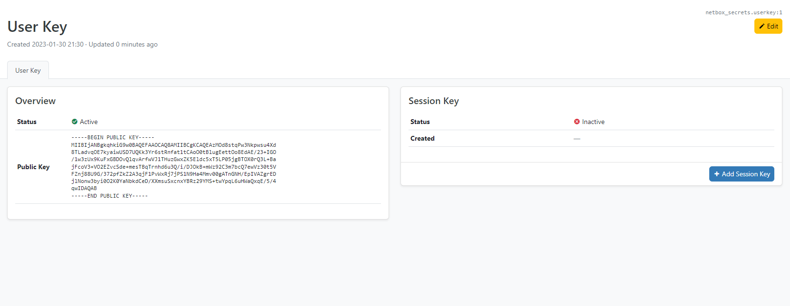
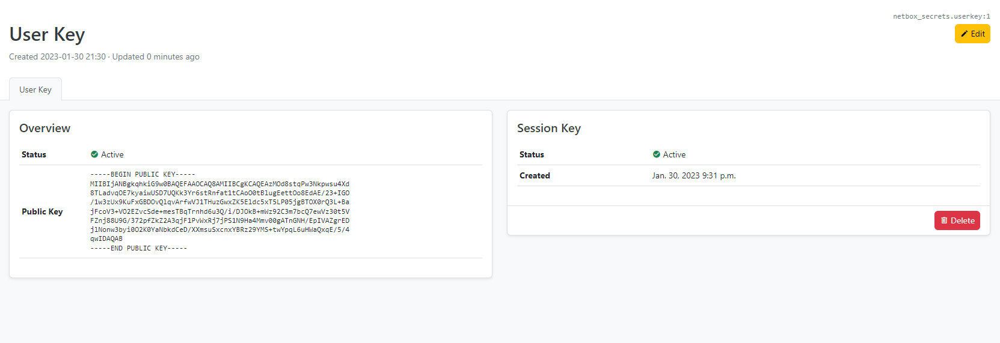
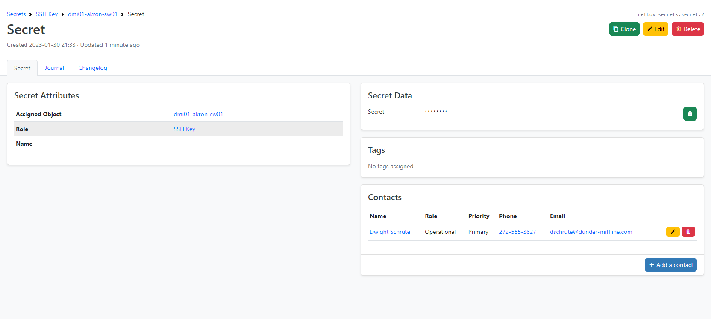
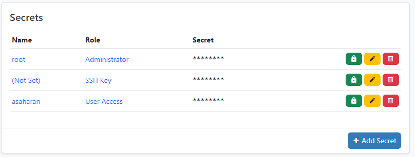
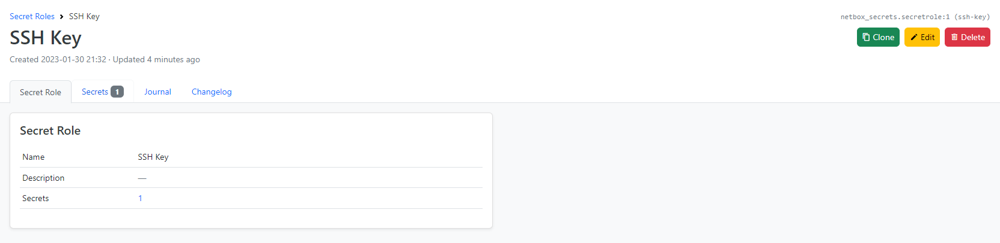

# Netbox Secrets

This is the continuation of the [NetBox Secretstore](https://github.com/DanSheps/netbox-secretstore) app. The original plugin
is minimally maintained and has a lot of issues. This plugin is a complete rewrite of the original plugin. It is more generic
and flexible than the original plugin. It is also regularly tested with the latest NetBox releases to ensure compatibility
and stability.

# Features

* Store secrets in the database encrypted with a public key (RSA)
* More generic and flexible than the original plugin (e.g. secrets can be assigned to any object in NetBox)
* Secrets can be assigned to contacts to associate them with a secret (e.g. SSH key)
* Updated user interface to make it easier to use and more intuitive to navigate
* Regularly tested with the latest NetBox releases to ensure compatibility and stability

# Compatibility

| NetBox Version | Plugin Version |
|----------------|----------------|
| 3.3.x          | 1.4.x, 1.5.x   |
| 3.4.x          | 1.6.x, 1.7.x   |
| 3.5.x          | 1.8.x          |
| 3.6.x          | 1.9.x          |
| 3.7.x          | 1.10.x         |
| 4.0.x          | 2.0.x          |
| 4.1.x          | 2.1.x          |
| 4.2.x          | 2.2.x          |
| 4.3.x          | 2.3.x          |

# Installation

* Install NetBox as per NetBox documentation
* Add to local_requirements.txt:
  * `netbox-secrets`
* Install requirements: `./venv/bin/pip install -r local_requirements.txt`
* Add to PLUGINS in NetBox configuration:
  * `'netbox_secrets',`
* Run migration: `./venv/bin/python netbox/manage.py migrate`
* Run collectstatic: `./venv/bin/python netbox/manage.py collectstatic --no-input`

You can view releases at: https://github.com/Onemind-Services-LLC/netbox-secrets/releases

# Configuration

The following options are available in the configuration file:

- `apps`
  - __Type__: `List`
  - __Description__: List of apps to enable
  - __Default__: `['dcim.device', 'virtualization.virtualmachine']`
- `display_default`
  - __Type__: `String`
  - __Description__: Where to display the secret on the detail page of the defined apps
  - __Default__: `left_page`
  - __Options__: `left_page`, `right_page`, `full_width_page`, `tab_view`
- `display_setting`
  - __Type__: `Dict`
  - __Description__: Set display setting for concrete model
  - __Default__: `{}`
  - __Options__: `{'app.model': 'display_default'}`
  - __Example__: `{'dcim.device': 'full_width_page', 'virtualization.virtualmachine': 'right_page'}`
- `public_key_size`
  - __Type__: `Integer`
  - __Description__: Size of the public key
  - __Default__: `2048`
  - __Options__: `2048`, `4096`, `8192`
- `top_level_menu`
  - __Type__: `Boolean`
  - __Description__: Enable top level menu
  - __Default__: `False`

## Extra Configuration

The following options are inherited from NetBox to configure the cookies:

- `SESSION_COOKIE_SECURE`
  - __Type__: `Boolean`
  - __Description__: [Session Cookie Secure](https://docs.netbox.dev/en/stable/configuration/security/#session_cookie_secure)
- `LOGIN_TIMEOUT`
  - __Type__: `Integer`
  - __Description__: [Login Timeout](https://docs.netbox.dev/en/stable/configuration/security/#login_timeout)

__Note: These options should be set in the NetBox configuration file.__


## Screenshots

### User key (Without Session)



### User key (With Session)



### Secret Object View



### Secret Panel on Device



### Secret Role Object View



## FAQ

1. How can I migrate the data from `netbox-secretstore`?

_Note: This is a one-way migration. You can't migrate back to `netbox-secretstore`. Ensure you do not have any data including tables for netbox-secrets already in the database_

These instructions assume that you are running Netbox v3.4.x and the plugin version 1.7.x. Install a new version
of `netbox_secretstore` as:

```shell
pip install git+https://github.com/Onemind-Services-LLC/netbox-secretstore@migration/nb34
```

_Note: You should have netbox-secretstore v1.4.4 installed now._

Make sure to add both plugins to the `configuration.py` before the migration.

Run the migration:

```shell
python manage.py migrate
```

Finally, readjust the indices for the `netbox-secrets` plugin

```shell
python manage.py sqlsequencereset netbox_secrets
```

Run the output of the previous command in the database.

You can now remove `netbox-secretstore` from the application. You may have clean up your database of the old tables manually.
